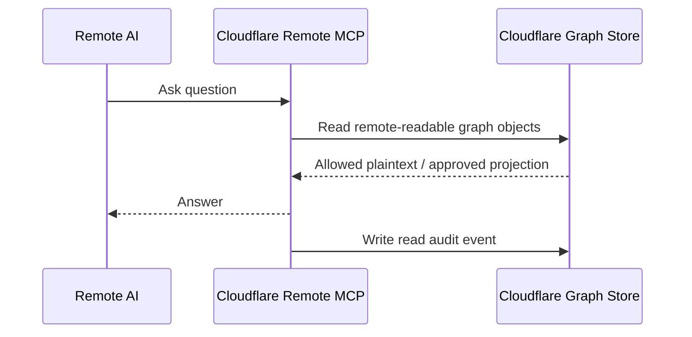
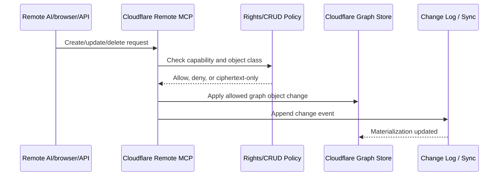
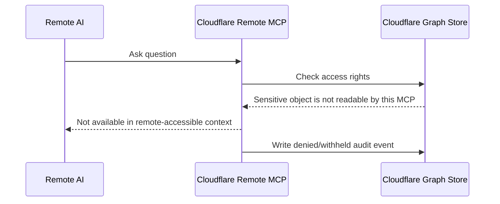
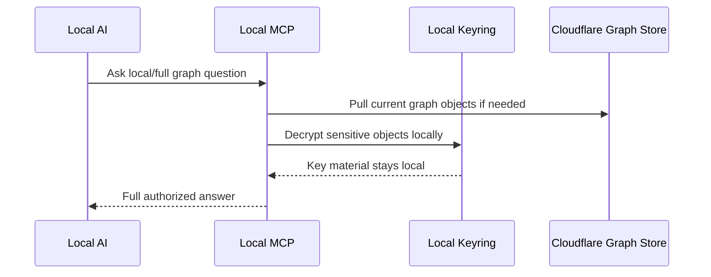
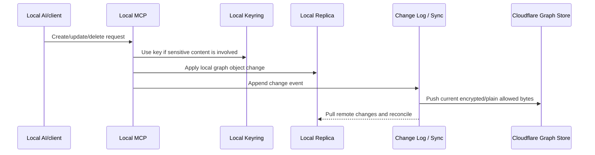
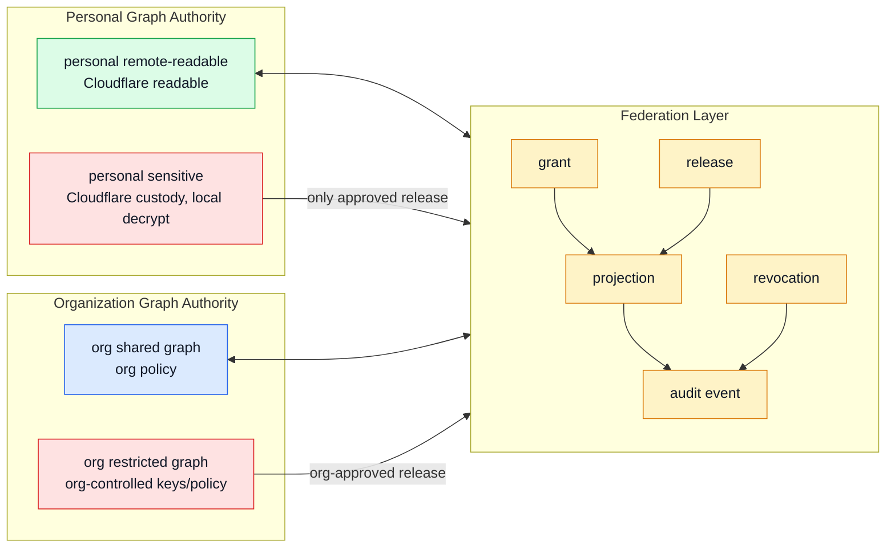

# Complete Cloudflare Custody Diagram

Status: Draft  
Date: 2026-06-21

## ELI5 Summary

Cloudflare is the warehouse for one knowledge graph.

The graph has different access rights. Some parts are readable by the remote
MCP. Some parts are vault boxes that Cloudflare stores but cannot open. A
trusted local device holds the vault key.

So Cloudflare can hold the complete graph without being able to read every
right-restricted part of it.

## Layered Model

This is the preferred architecture diagram for building the rest of the system.
It keeps local and remote ingress at the same level, then shows MCP access,
CRUD authorization, the one logical graph, the two places that graph is
materialized, and the sync/change layer that keeps both materializations current.

```mermaid
flowchart TB
  classDef cloud fill:#dbeafe,stroke:#2563eb,color:#111827
  classDef local fill:#dcfce7,stroke:#16a34a,color:#111827
  classDef sensitive fill:#fee2e2,stroke:#dc2626,color:#111827
  classDef ai fill:#f3e8ff,stroke:#7e22ce,color:#111827
  classDef audit fill:#fef3c7,stroke:#d97706,color:#111827
  classDef graph fill:#f8fafc,stroke:#475569,color:#111827

  subgraph L0["Layer 0 - Ingress"]
    direction LR
    RemoteAI["Remote ingress\nAI / browser / API client\nfull CRUD via remote MCP"]:::ai
    LocalAI["Local ingress\nAI / desktop / local CLI\nfull CRUD via local MCP"]:::ai
  end

  subgraph L1["Layer 1 - MCP Access"]
    direction LR
    RemoteMCP["Remote MCP\nCloudflare-hosted\nCRUD within remote capabilities"]:::cloud
    LocalMCP["Local MCP\ntrusted local device\nCRUD within local capabilities"]:::local
  end

  subgraph L2["Layer 2 - Capability, Rights, And CRUD Policy"]
    direction LR
    RemoteRights["Remote capability\ncreate/read/update/delete allowed objects\ncannot decrypt sensitive plaintext"]:::cloud
    LocalRights["Local capability\ncreate/read/update/delete full authorized graph\nuses local keyring for sensitive"]:::local
    RightsManifest["Access-rights manifest\nobject rights, CRUD permissions, generation"]:::graph
  end

  subgraph L3["Layer 3 - One Logical Knowledge Graph"]
    direction LR
    KG["One Knowledge Graph\nsame logical graph everywhere"]:::graph
    RemoteReadable["Remote-readable objects"]:::cloud
    SensitiveObjects["Sensitive encrypted objects"]:::sensitive
    Releases["Operator-published releases\noptional remote-readable projections"]:::cloud
  end

  subgraph L4["Layer 4 - Materialization / Storage"]
    direction LR
    CloudflareStore["Cloudflare custody\ncomplete graph bytes\nreadable + encrypted sensitive"]:::cloud
    LocalReplica["Local replica\ncomplete graph synced locally\nplaintext only after local decrypt"]:::local
    Keyring["Local keyring\nsensitive keys never stored in Cloudflare"]:::sensitive
    Indexes["Segmented indexes\nby id, type, edge, time, access, activity"]:::graph
  end

  subgraph L5["Layer 5 - Sync / Change Reconciliation"]
    direction LR
    ChangeLog["Append-only change log\nCRUD ops, tombstones, versions"]:::graph
    SyncEngine["Bidirectional sync engine\nkeeps Cloudflare and local fully synced"]:::audit
    Conflict["Conflict resolver\nlocal/user policy for divergent edits"]:::audit
    OfflineQueue["Offline queues\nremote/local pending changes"]:::audit
  end

  subgraph L6["Layer 6 - Observability"]
    direction LR
    ActivityStream["Live activity stream\nnear-real-time graph firing"]:::audit
    RemoteAudit["Remote audit\nremote CRUD, denials, releases, sync"]:::audit
    LocalAudit["Local audit\nlocal CRUD, decrypts, releases, sync"]:::audit
    Replay["Replay / inspector\nrepeatable activity + CRUD history"]:::audit
  end

  RemoteAI --> RemoteMCP
  LocalAI --> LocalMCP

  RemoteMCP --> RemoteRights
  LocalMCP --> LocalRights
  RemoteRights --> RightsManifest
  LocalRights --> RightsManifest

  RightsManifest --> KG
  KG --> RemoteReadable
  KG --> SensitiveObjects
  KG --> Releases

  CloudflareStore --> RemoteReadable
  CloudflareStore -. "stores ciphertext only" .-> SensitiveObjects
  CloudflareStore --> Releases
  CloudflareStore --> RightsManifest

  LocalReplica --> RemoteReadable
  LocalReplica --> SensitiveObjects
  CloudflareStore --> Indexes
  LocalReplica --> Indexes
  Keyring -->|"decrypt locally"| LocalMCP
  LocalMCP --> LocalReplica
  LocalMCP -->|"may publish operator-approved release"| Releases

  RemoteMCP -->|"semantic CRUD allowed objects"| RemoteReadable
  RemoteMCP -->|"read releases"| Releases
  RemoteMCP -. "no key / no plaintext" .-> SensitiveObjects
  RemoteMCP -->|"custody/version/tombstone\nsigned ciphertext envelopes"| SensitiveObjects

  RemoteMCP --> ChangeLog
  LocalMCP --> ChangeLog
  ChangeLog --> SyncEngine
  SyncEngine <--> CloudflareStore
  SyncEngine <--> LocalReplica
  OfflineQueue --> SyncEngine
  SyncEngine --> Indexes
  Conflict --> SyncEngine

  RemoteMCP --> RemoteAudit
  LocalMCP --> LocalAudit
  RemoteMCP --> ActivityStream
  LocalMCP --> ActivityStream
  ChangeLog --> Replay
  ActivityStream --> Replay
```

## Who Can Do What

| Actor | Runtime | CRUD Remote-Readable | CRUD Sensitive | Can Publish Release | Sync Responsibility |
|---|---|---:|---:|---:|---|
| Remote AI provider | external | via remote MCP | no plaintext through Cloudflare MCP | no direct publish | creates remote-readable changes |
| Trusted keyholding browser/client | user-controlled client outside Cloudflare | via remote MCP for upload/sync | decrypts/encrypts locally, submits authenticated ciphertext envelopes | no direct publish | creates encrypted-envelope changes |
| Remote MCP | Cloudflare | yes, within remote capability | ciphertext custody/version/tombstone only; no plaintext semantic edits | no | writes remote change events |
| Local AI/client | trusted local | via local MCP | yes, through local MCP/keyring | no direct publish | creates local changes |
| Local MCP | trusted local | yes, within local capability | yes, with local keyring | yes, operator-approved | writes local change events |
| Sync engine | local + cloud protocol | syncs | syncs ciphertext | syncs releases | keeps both materializations current |
| Cloudflare storage | Cloudflare | stores current bytes | stores ciphertext only | stores release objects | custody/materialization |

The important point is that the graph is one graph. The access rights differ by
actor and runtime. Both ingress paths support CRUD; the difference is whether
they can inspect/decrypt the object being changed.

## CRUD Rule

Both ingress paths must be complete CRUD paths:

```text
Remote ingress -> remote MCP -> capability check -> change log -> sync
Local ingress  -> local MCP  -> capability check -> change log -> sync
```

But CRUD is not the same as plaintext authority:

- Remote MCP can create/read/update/delete remote-readable objects.
- Remote MCP can store, version, tombstone, and replicate sensitive encrypted
  objects only as authenticated ciphertext envelopes; it cannot inspect or
  semantically edit sensitive plaintext.
- A remote browser/client that holds a user key may encrypt/decrypt locally and
  send ciphertext to Cloudflare, but the Cloudflare MCP still does not get the
  key.
- Local MCP can create/read/update/delete the full authorized graph because it
  can use the local keyring.

## Full Sync Rule

Cloudflare and local must stay in full sync at the graph-object level.

```text
Cloudflare materialization == complete graph bytes
Local materialization      == complete graph bytes + local decrypt/index
```

Full sync means:

- every create/update/delete produces a change event
- deletions are tombstones until safely compacted
- local and remote materializations converge on the same object versions
- encrypted sensitive objects sync as ciphertext
- local indexes are rebuildable from the synced graph
- conflicts are explicit and auditable, not silently overwritten
- either side can be offline and later catch up through queued change segments

At 100M scale, full sync is manifest/segment/cursor based. The system must not
sync by listing every object or scanning every file.

Offline sync rule:

```text
online:  changes stream continuously both ways
offline: available side appends durable changes
return:  compare cursors/generations, exchange missing segments, resolve conflicts
```

## Live Activity And Audit Rule

Every CRUD, search, traversal, sync, decrypt, denial, and release operation must
produce activity events.

```text
MCP operation
  -> capability check
  -> graph objects touched
  -> live activity stream
  -> durable audit/change log
  -> replay / inspector
```

The live stream powers the near-real-time "graph firing" view. The durable
audit ledger is the repeatable security trail. Mutation sync uses a separate
change log. These systems share an operation id so the operator can click a
flash in the UI and inspect the exact CRUD, audit, and sync records behind it.

## Technical Version

Cloudflare stores one complete knowledge graph. Objects in that graph carry
access rights:

| Layer | Stored In Cloudflare | Readable By Remote MCP | Readable By Local MCP | Purpose |
|---|---|---:|---:|---|
| Remote-readable portions | yes | yes | yes | everyday notes, project context, approved working knowledge |
| Sensitive portions | yes, encrypted | no | yes | raw journals, sensitive relationships, legal/medical/family/high-risk context |
| Rights manifests and cursors | yes | partial | yes | sync generations, opaque object IDs, access classes, CRUD rights, graph completeness |
| Operator-published releases | yes, if explicitly published | yes | yes | optional scoped output from sensitive-origin content |
| Change log / audit events | yes, redacted remotely | yes for allowed/redacted records | yes | CRUD, denied reads, releases, sync, conflict history |

## Request Flow

### Normal Remote Query



### Remote CRUD



### Sensitive Context Query



### Local AI Full-Graph Query



### Local CRUD And Sync



## Future Federation View

Federation is not a V1 feature. The diagram below is a compatibility direction
for organization/personal graphs after the single-authority V1 is stable.



## Key Rule

Cloudflare can have all the bytes. It should not have all the keys.

```text
One complete graph in Cloudflare:
  remote-readable bytes   -> remote MCP can CRUD within rights
  sensitive bytes         -> encrypted; remote can custody ciphertext only
  rights/cursors          -> enough to enforce access, CRUD, and sync
  change log              -> every create/update/delete/tombstone
  releases                -> explicit, audited, operator-published
```

## What Remote MCP Can Do

Remote MCP can:

- answer from remote-readable graph data
- create/update/delete remote-readable graph objects within capability
- store, version, tombstone, and replicate sensitive graph objects only as
  authenticated encrypted envelopes
- list or traverse approved remote graph structure
- return a generic withheld/denied response when requested context is not
  available to that actor
- read approved release objects after local MCP/operator publishes them
- write audit events
- write sync/change events

Remote MCP cannot:

- decrypt sensitive blobs by itself
- semantically edit sensitive plaintext
- call local MCP tools directly
- silently read the local-sensitive graph
- create local work items for the local MCP in V1
- access a future graph authority without an explicit grant/projection
- coordinate federation in V1

## Why This Keeps MCP Useful

Most normal work stays fast and remote:

```text
AI -> Cloudflare MCP -> remote-readable graph -> answer
```

Sensitive work uses the local AI path:

```text
Local AI -> local MCP -> local decrypt -> full authorized answer
```

Full personal work remains available locally:

```text
Local Atlas/MCP -> complete synced graph -> local decrypt -> full answer
```

## Design Implication

The important architectural split is not "cloud graph" versus "local graph." It
is:

```text
Cloudflare custody of one complete graph
  +
object-level access rights
  +
local-only keys for the sensitive class
  +
future federated grants/projections between authorities
```

That keeps Cloudflare-first deployment possible without making Cloudflare the
full-trust reader of the private graph.
