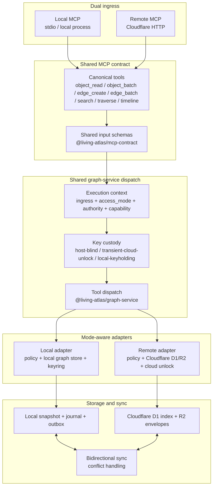

# Dual Ingress Shared Graph Service

Living Atlas exposes one MCP tool contract through two ingress paths.

- Local ingress uses stdio/local process delivery.
- Remote ingress uses Cloudflare HTTP MCP delivery.
- Both ingress paths enter the same graph-service dispatch boundary.
- The service carries ingress, access mode, authority, client, capability, and
  key-custody context on every tool call.
- Storage, sync, and key behavior remain adapter-specific.

## Mode Rules

| Ingress | Access mode | Key custody | Sensitive plaintext |
|---|---|---|---|
| local stdio | `local-keyholding-only` | local keyholding | allowed by local policy |
| remote HTTP | `remote-safe-only` | host-blind | unavailable |
| remote HTTP | `cloud-unlock-session` | transient cloud unlock | available only for that request if normal auth and policy allow it |

## Implementation Boundary

The shared graph-service layer does not own storage. It owns the supportable
runtime boundary:

- validate that the requested tool is in the canonical MCP catalog
- attach the resolved ingress and access mode to the call
- derive key-custody semantics from mode
- dispatch into the selected local or remote adapter
- orchestrate bounded bulk tools such as `object_batch` and `edge_batch`

Adapters remain responsible for storage-specific details, policy enforcement,
sync writes, audit emission, and decrypt mechanics.

## Bulk Tool Boundary

`object_batch` and `edge_batch` reduce incoming MCP/Worker request count while
preserving per-item validation, idempotency, audit, and storage accounting.
They do not pretend that D1 rows, R2 operations, KV keys, queue messages, or
Vectorize dimensions become free. Those meters remain per row, object/key,
message, or vector dimension. The Cloudflare remote ingress uses a conservative
default item cap so a single free-tier Worker invocation does not accidentally
burn through subrequest or CPU limits.

Current caps:

| Ingress | Max items | Max payload | Reason |
|---|---:|---:|---|
| remote HTTP | 10 | 1 MiB | Keep one free-tier Worker request comfortably under CPU/subrequest pressure. |
| local stdio | 100 | 1 MiB | Local can amortize client chatter without involving Cloudflare request limits. |

Batch behavior:

- A batch is scoped to one `authority_id`; item-level authority overrides must
  match the batch authority.
- If a batch `idempotency_key` is supplied, each item receives a deterministic
  child key in the `la_idem_*` namespace.
- Results are per item. Partial failure does not hide which operation failed.
- The response includes `usage_estimate.worker_requests_saved_vs_single_item`
  and explicit booleans showing D1/R2 accounting still happens per underlying
  write/object.

Cloudflare references used for the cap rationale:

- [Workers limits](https://developers.cloudflare.com/workers/platform/limits/)
- [Workers pricing](https://developers.cloudflare.com/workers/platform/pricing/)
- [D1 pricing](https://developers.cloudflare.com/d1/platform/pricing/)
- [R2 pricing](https://developers.cloudflare.com/r2/pricing/)
- [Queues pricing](https://developers.cloudflare.com/queues/platform/pricing/)
