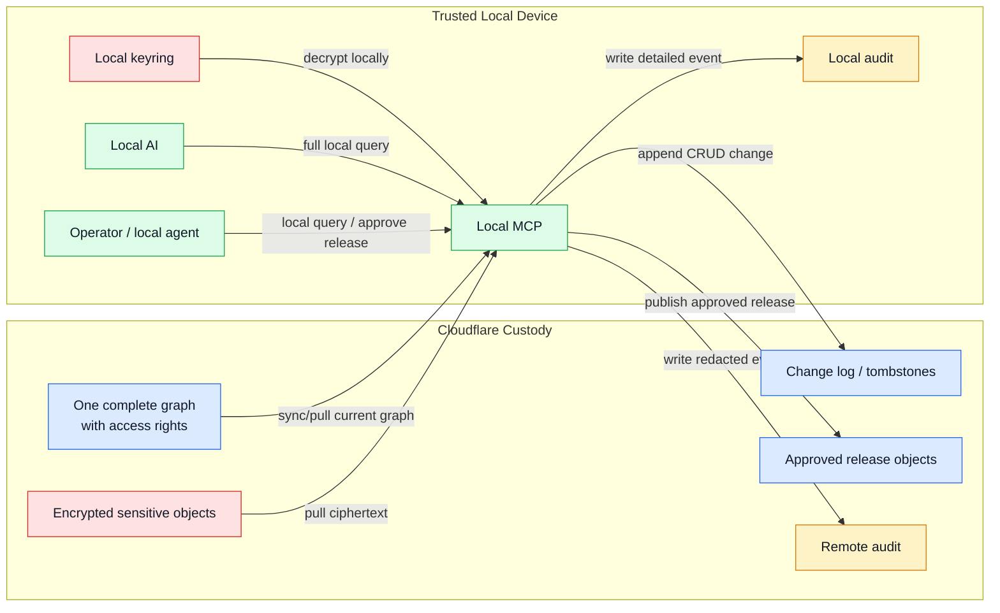

# Local MCP Boundary

Status: Draft  
Date: 2026-06-21

## Purpose

Define the local MCP as a private, operator-controlled authority. The remote MCP
must not be able to call into it as a hidden backend.

## Short Definition

The local MCP is the trusted CRUD surface, decryptor, indexer, sync participant,
and release producer for the full personal graph.

It is not a remote service dependency and it is not protected merely by binding
to `localhost`. See `local-mcp-authentication.md` for the required local auth
contract.

## Boundary Rule

Remote MCP cannot directly invoke local MCP tools.

Allowed pattern:

```text
Local AI   -> asks local MCP
Local MCP  -> creates/reads/updates/deletes locally within rights
Local MCP  -> optionally publishes an operator-approved release/projection
Remote MCP -> reads approved release later
```

Disallowed pattern:

```text
Remote MCP -> calls local MCP -> gets sensitive answer
Remote MCP -> writes local work that local MCP must process
```

This keeps local control explicit. The local device is not a secret backend for
remote AI. It is a private authority that may choose to publish release objects.

## Local MCP Responsibilities

Local MCP can:

- pull the complete graph from Cloudflare custody
- decrypt sensitive graph objects using local keys
- build the full local index
- answer local-only questions
- create, update, and delete graph objects under local policy
- append local change events and sync them to Cloudflare
- produce summaries, redactions, or snippets
- publish approved releases to Cloudflare
- write high-detail local audit events
- sync local changes or encrypted sensitive objects back to Cloudflare

Local MCP must:

- authenticate every local client
- enforce local capabilities such as `local-read`, `local-crud`,
  `local-release`, `sync-device`, and `local-admin`
- reject remote/cloud tokens
- log failed authentication and denied local capability attempts
- keep admin/raw tools separate from ordinary local CRUD

Local MCP should not:

- expose a public inbound network API by default
- accept remote MCP tool calls
- treat Cloudflare-held tokens as sensitive-data unlock keys; any cloud unlock
  must use the explicit `cloud-unlock-session` mode and a transient key that is
  never stored by Cloudflare
- silently release sensitive context
- make the local device an unobservable dependency for remote answers

## Inputs and Outputs



## Release Object

A release is a deliberate object created by the local MCP. It may be a snippet,
summary, redaction, answer, or projection. It should include:

- release id
- source authority
- target authority or MCP profile
- expiry
- allowed purpose
- source references as opaque IDs
- audit event id
- revocation state

Remote MCP reads releases. It does not read the local graph.

## Operator Experience

The local UI should show:

- what remote MCP can already answer
- what remote MCP cannot know because it is local-private
- what sensitive material would be involved
- proposed release text
- expiry and revocation controls
- audit trail

The key UX principle: local release is visible and intentional.
