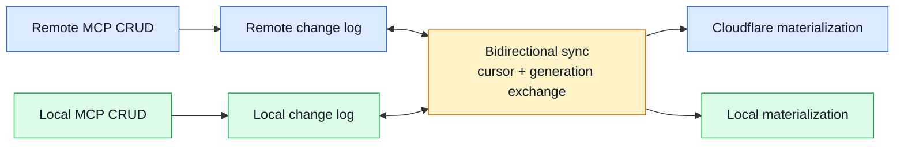
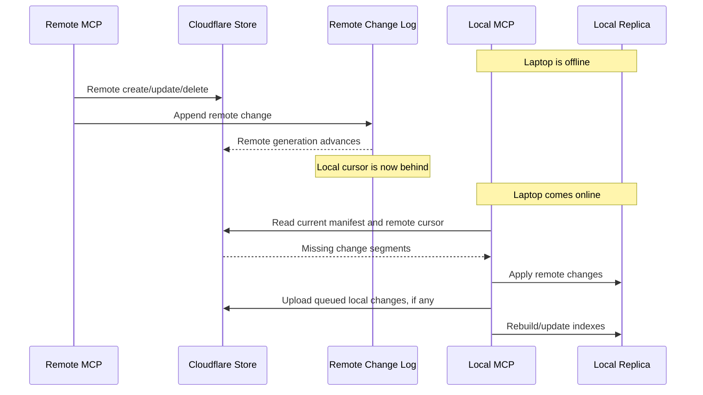
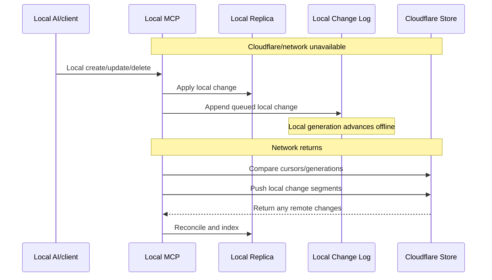

# Offline Sync And Conflict Resolution

Status: Draft  
Date: 2026-06-21

## Purpose

Remote and local systems should stay continuously in sync when both are online,
but either side must tolerate the other being offline for a while. A laptop can
be turned off, a network can drop, or Cloudflare can be temporarily unreachable.

The system must preserve CRUD history, converge cleanly, and surface conflicts
instead of silently overwriting knowledge.

## Core Rule

Every write goes through an append-only change log. Sync exchanges changes,
not assumptions.

```text
remote CRUD -> remote change log -> sync -> local replica
local CRUD  -> local change log  -> sync -> Cloudflare custody
```

If either side is offline, changes queue locally until sync resumes.

## Normal Online Flow



## Offline Laptop Flow



## Offline Remote Flow



## Sync State

Each materialization tracks:

- authority id
- local generation
- remote generation
- last synced change id
- missing segment list
- pending upload list
- conflict set
- last successful sync time
- sync health state

Health states:

- `synced`
- `behind-remote`
- `ahead-local`
- `diverged`
- `conflict-review-needed`
- `offline`
- `blocked`

## Conflict Detection

Every mutation includes:

- object id
- base version
- new version
- actor
- timestamp
- operation
- content hash
- access class
- encryption class

Conflict exists when two changes share the same base version and produce
different next versions, or when one side deletes/tombstones an object the other
side updates.

## Conflict Classes

| Conflict | Example | Default Handling |
|---|---|---|
| update/update | remote and local edit same object | create conflict record; keep both versions |
| update/delete | local edits object remote deleted | keep tombstone plus edited branch; require review |
| rights/content | one side changes access rights while other edits content | fail closed for remote access; require review |
| encrypted/plaintext | remote has ciphertext update, local has plaintext semantic edit | local resolves after decrypting |
| release/source | release points to source that changed or was tombstoned | mark release stale |

## Conflict Records

Conflicts are first-class graph/system objects:

```json
{
  "conflict_id": "conf_...",
  "object_id": "obj_...",
  "base_version": "v10",
  "left_change": "chg_remote_...",
  "right_change": "chg_local_...",
  "class": "update/update",
  "status": "open",
  "detected_at": "2026-06-21T00:00:00Z",
  "resolution": null
}
```

Conflict records appear in Atlas and in the audit/replay timeline.

## Resolution Policy

Do not silently overwrite at v1.

Allowed resolutions:

- choose remote version
- choose local version
- merge manually
- keep both as branches
- restore deleted object
- accept tombstone
- mark release stale and regenerate

Resolution itself appends a change event.

## Serving Behavior During Conflicts

Remote MCP must have deterministic behavior while conflicts are open:

| Conflict State | Remote-Readable Object | Local-Private/Sensitive Object | Release |
|---|---|---|---|
| no conflict | serve current allowed version | ciphertext custody only | serve if current |
| update/update | serve last non-conflicted allowed version and mark stale in audit | fail closed for plaintext | mark stale if source involved |
| update/delete | do not serve deleted/tombstoned branch until resolved | fail closed for plaintext | mark stale |
| rights/content | fail closed for remote access | fail closed for plaintext | mark stale/revoke pending review |
| encrypted/plaintext | no semantic remote edit | fail closed for plaintext | not created until resolved |

Serving a last non-conflicted remote-readable version is allowed only when the
object's access class remains `remote-safe`, `shareable`, or `release`, and
the conflict is not about rights or deletion. The response should include a
stale/conflict marker to authorized clients when safe; the public denial path
must not leak sensitive object existence.

## Sensitive Data Rule

Cloudflare can sync sensitive objects as ciphertext, but cannot resolve
plaintext-sensitive semantic conflicts.

If conflict resolution requires decrypting sensitive content:

```text
remote detects divergence
local sync pulls branches
local MCP decrypts locally
operator/local policy resolves
resolution syncs back as ciphertext/change events
```

Remote access remains fail-closed while the sensitive conflict is open.

N-way conflicts are represented as a conflict set, not a chain of pairwise
overwrites. Resolution chooses or creates a new canonical version from the set.

## Continuous Sync Behavior

When online:

- remote changes should be visible locally quickly
- local changes should be pushed to Cloudflare quickly
- indexes update incrementally
- activity stream shows sync pushes/pulls

When offline:

- writes continue on the available side
- changes queue durably
- UI shows stale/behind/ahead state
- remote MCP continues for remote-readable graph if Cloudflare is online
- local MCP continues for local replica if laptop is online

## UI Requirements

Living Atlas must show:

- current sync health
- local generation vs remote generation
- pending uploads
- pending downloads
- conflict count
- stale releases
- last successful sync
- offline banner when applicable
- replayable sync events

The operator should be able to click a conflict and see:

- object
- versions
- who changed what
- when each side changed
- access class
- suggested resolution
- audit history

## 100M Scale Rule

Sync must be manifest/segment/cursor based. Never compare by listing every
object.

At large scale:

- sync exchanges manifests and segment ids
- missing segments are downloaded by partition
- object-level conflicts are found through change indexes
- activity/replay queries are scoped
- compaction is separate from synchronization
- long-offline clients that missed retained change history use snapshot/segment
  catch-up, then reconcile queued local changes against that snapshot

## Build Implication

From v1, every object and change event needs:

- stable id
- base version
- new version
- generation
- authority id
- actor id
- access class
- encryption class
- content hash

Without these, offline sync and conflict resolution will become a retrofit.
