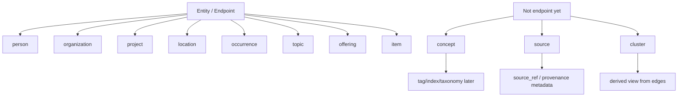
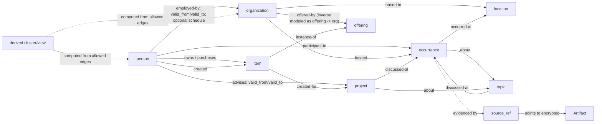

# Entity And Temporal Schema Map

Status: updated schema implementation target
Date: 2026-06-23

## Purpose

Living Atlas has two related schemas:

1. **Entity / endpoint schema** - what kinds of things can sit on either side
   of typed graph relationships.
2. **Temporal fact schema** - how Atlas records relationships, happenings,
   time spans, recurrence, and evidence.

These schemas are connected, but they should not be collapsed into one bucket.
Some things are graph endpoints, some are temporal facts, some are evidence, and
some are derived views.

## Entity / Endpoint Schema

Implemented temporal edge endpoints:

| Type | Meaning | Current status |
|---|---|---|
| `person` | A human actor. | Implemented |
| `organization` | A company, institution, formal group, team, cohort, or durable named association. | Implemented |
| `project` | A temporary or bounded initiative, deal, effort, campaign, or build. | Implemented |
| `location` | A physical or geographic place. | Implemented |
| `occurrence` | A thing that happened, is happening, or is scheduled to happen. | Implemented in the updated schema contract. |
| `topic` | A controlled theme, subject, question, risk, skill, or domain. | Implemented in the updated schema contract. |
| `offering` | Something offered, sold, booked, licensed, subscribed to, or otherwise available from a provider. | Implemented in the updated schema contract. |
| `item` | A specific thing owned, bought, received, reserved, created, or handled. | Implemented in the updated schema contract. |

Endpoint summary:

| Type | Meaning | Rule |
|---|---|---|
| `person` | A human actor. | Keep as a core endpoint. |
| `organization` | A company, institution, formal group, team, cohort, or durable named association. | Keep as a core endpoint. |
| `project` | A temporary or bounded initiative, deal, effort, campaign, or build. | Keep as a core endpoint. |
| `location` | A physical or geographic place. | Keep as a core endpoint. |
| `occurrence` | A thing that happened, is happening, or is scheduled to happen. | Use `occurrence` instead of `event` to avoid confusing knowledge happenings with audit/sync/runtime events. |
| `topic` | A controlled subject or theme. | Use `topic` instead of broad `concept`; do not auto-create topics from every noun phrase. |
| `offering` | A provider-facing product, service, subscription, travel class, hotel room type, ticket class, package, or experience. | Use for reusable options available from a provider. |
| `item` | A specific device, document, ticket, reservation, receipt, seat, room, deliverable, or created work. | Use for concrete instances, ownership, purchases, bookings, and produced things. |

Not temporal edge endpoints yet:

| Type | Reason | Current representation |
|---|---|---|
| `concept` | Uncontrolled concepts can explode into vague AI-generated nodes. | Tags, metadata, reference indexes, or explicit promotion to controlled `topic`. |
| `source` | Provenance is usually metadata, not a graph entity. | `source`, `source_ref`, `source_path_ref`, hashes, and audit/provenance fields. |
| `cluster` | A cluster is a computed view over graph topology, not an authored fact. | Derived graph view/query output. Manual groups become `organization` or `project`. |



## Endpoint Subtypes And Fields

Every endpoint gets the common fields below. Type-specific fields stay small
until real data proves they are needed.

### Common endpoint fields

| Field | Required | Meaning |
|---|---|---|
| `object_id` | yes | Stable Atlas object id. |
| `type` | yes | One of the endpoint types. |
| `subtype` | no | Controlled subtype within the endpoint type. |
| `name` | yes | Primary display name/title. |
| `aliases` | no | Alternate names, acronyms, or labels. |
| `description` | no | Short neutral description. |
| `access_class` | yes | Runtime policy boundary; does not come from schema type alone. |
| `source_ref` | yes for imported data | Opaque provenance reference, not plaintext source content. |
| `confidence` | no | `high`, `medium`, or `low`. |
| `created_at` / `updated_at` | yes | Runtime/system timestamps. |

### `person`

Subtypes:

- `individual`
- `role-account` (named public/professional role where the human identity is not
  the useful graph anchor)

Fields:

| Field | Meaning |
|---|---|
| `name` | Primary person label. |
| `aliases` | Alternate names or handles. |
| `primary_location_ref` | Optional link to `location`; do not duplicate `based-in` edges. |
| `notes_ref` | Optional encrypted note/body reference. |

Relationship and lifecycle facts should be edges or occurrences, not fields on
the person node.

### `organization`

Subtypes:

- `company`
- `nonprofit`
- `government`
- `education`
- `fund`
- `community`
- `team`
- `cohort`
- `family-office`
- `other`

Fields:

| Field | Meaning |
|---|---|
| `name` | Primary organization label. |
| `aliases` | Alternate names, acronyms, or prior names. |
| `founded_year` | Year attribute when known; not an edge. |
| `homepage_ref` | Optional opaque external reference. |
| `primary_location_ref` | Optional link to `location`; durable geography still uses `based-in`. |

Durable human-authored groups and cohorts use `organization` or `project`, not
`cluster`.

### `project`

Subtypes:

- `initiative`
- `deal`
- `research`
- `campaign`
- `engagement`
- `case`
- `other`

Fields:

| Field | Meaning |
|---|---|
| `name` | Primary project label. |
| `aliases` | Alternate project names. |
| `status` | Project status when useful; relationship status still lives on edges. |
| `start_date` / `end_date` | Project-level date bounds when known. |
| `primary_location_ref` | Optional link when the project is place-bound. |

Use `project` for bounded efforts and workstreams. Use `offering` for products
or services such as Kai, a hotel suite type, an airline class, or a subscription.

### `offering`

Subtypes:

- `product`
- `software-product`
- `hardware-product`
- `service`
- `subscription`
- `membership`
- `hotel-room-type`
- `travel-class`
- `fare-class`
- `ticket-class`
- `menu-item`
- `media`
- `experience`
- `package`
- `other`

Fields:

| Field | Meaning |
|---|---|
| `name` | Primary offering label. |
| `aliases` | Alternate product, service, or package names. |
| `provider_ref` | Optional organization that offers, sells, books, or licenses it. |
| `homepage_ref` | Optional opaque external reference. |
| `status` | Offering status when useful. |

Use `offering` for reusable things available from a provider: software
products, hotel suite types, airline classes, service packages, subscriptions,
ticket classes, menu items, and experiences.

### `item`

Subtypes:

- `device`
- `document`
- `ticket`
- `reservation`
- `receipt`
- `file`
- `photo`
- `physical-item`
- `vehicle`
- `seat`
- `room`
- `deliverable`
- `created-work`
- `other`

Fields:

| Field | Meaning |
|---|---|
| `name` | Primary item label. |
| `aliases` | Alternate item labels. |
| `offering_ref` | Optional link to the offering/model/class this item is an instance of. |
| `owner_ref` | Optional owner when known. |
| `location_ref` | Optional place where the item is or was used. |
| `acquired_on` | Optional date when bought, received, booked, or acquired. |
| `status` | Item state when useful. |

Use `item` for concrete instances: a specific device, ticket, reservation,
receipt, seat, room, document, deliverable, or thing created for someone.

### `location`

Subtypes:

- `country`
- `region`
- `city`
- `venue`
- `address`
- `site`
- `other`

Fields:

| Field | Meaning |
|---|---|
| `name` | Primary place label. |
| `aliases` | Alternate names. |
| `parent_location_ref` | Optional containing place. |
| `geo` | Optional coordinates or shape. |
| `timezone` | Optional IANA timezone when events/schedules need local time. |

Use `location` for physical/geographic places. Do not use it for abstract
online spaces unless a future virtual-place subtype is explicitly accepted.

### `occurrence`

Subtypes:

- `meeting`
- `appointment`
- `social`
- `work-session`
- `travel`
- `milestone`
- `life-event`
- `observation`
- `transaction`
- `other`

Fields:

| Field | Required | Meaning |
|---|---|---|
| `name` | yes | Neutral occurrence label. |
| `subtype` | no | Controlled occurrence subtype. |
| `occurred_on` | yes unless only planned | Actual world-time start/instant. |
| `occurred_until` | no | Actual world-time end for bounded happenings. |
| `scheduled_start` / `scheduled_end` | no | Planned time when actual time is unknown or differs. |
| `timezone` | required for local/recurring time | IANA timezone for local wall-clock interpretation. |
| `location_ref` | no | Link to `location`. |
| `participant_refs` | no | Links to people or organizations. |
| `organizer_refs` | no | Links to hosts/organizers. |
| `project_refs` | no | Projects discussed, advanced, or affected. |
| `source_ref` | yes for imported data | Opaque provenance reference. |
| `recurrence_ref` | no | Link to a recurrence series when this is a materialized instance. |
| `recurrence` | no | Embedded `IcalendarRecurrenceSchema` object when this is a recurring occurrence series. |
| `status` | no | `planned`, `occurred`, `canceled`, `moved`, or `tentative`. |

Sensitive details stay in encrypted note/body payloads or event-scoped
attributes with the correct `access_class`; do not force them into public
metadata.

### `topic`

Subtypes:

- `domain`
- `theme`
- `skill`
- `interest`
- `risk`
- `question`
- `other`

Fields:

| Field | Meaning |
|---|---|
| `name` | Controlled topic label. |
| `aliases` | Alternate topic labels. |
| `description` | Short neutral definition. |
| `parent_topic_ref` | Optional parent topic for a controlled hierarchy. |
| `controlled` | Always `true` for topic endpoints. |
| `tags` | Optional lightweight labels for import/search. |

Use `topic` for durable, intentionally curated subjects. Do not create a topic
for every noun phrase, model-generated keyword, or one-off prose concept.

## Temporal Fact Schema

Temporal facts describe what was true, what happened, what repeats, and what
supports a claim.

| Fact type | Use for | Time fields |
|---|---|---|
| `temporal edge` | Durable relationship or state over time. | `valid_from`, `valid_to` |
| `occurrence` | Point-in-time or bounded happening. | `occurred_on`, `occurred_until` |
| `iCalendar recurrence` | Repeating planned pattern without materializing infinite future instances. | `timezone`, `recurrence_set`, duration, exceptions |
| `source/evidence reference` | Provenance for an edge or occurrence. | source-specific metadata; no graph endpoint requirement |

Examples use synthetic names only:

```text
Person A --employed-by--> Organization B
  valid_from: 2024-01-01
  valid_to: 2025-06-01
  schedule:
    timezone: America/Chicago
    recurrence_set: |
      DTSTART;TZID=America/Chicago:20260621T080000
      RRULE:FREQ=WEEKLY;BYDAY=MO,WE,FR
    duration: PT7H
```

```text
occurrence: Monthly Community Dinner
  kind: social
  occurred_on: 2026-06-02T19:00:00
  occurred_until: 2026-06-02T21:00:00
  occurred_at: Location C
  participants: [Person A, Person B]
```

Recurring occurrence series are represented as schedule rules plus materialized
instances only when needed:

```text
occurrence_series: Monthly Community Dinner
  timezone: America/Chicago
  recurrence_set: |
    DTSTART;TZID=America/Chicago:20260602T190000
    RRULE:FREQ=MONTHLY;BYDAY=TU;BYSETPOS=1
  duration: PT2H
  location_ref: Location C
```

Materialize an occurrence instance only when it actually happens, is edited,
is canceled, needs audit, has participants/details, or is needed as evidence.

## Together



## Standards Alignment

Use existing standards where they fit, but keep Atlas field names consistent
with the temporal-edge model.

| Concern | Standard to follow | Atlas use |
|---|---|---|
| Recurrence | iCalendar RFC 5545 `DTSTART`, `RRULE`, `RDATE`, `EXDATE`, `DURATION` | Store recurrence schedules as RFC 5545 recurrence lines in `recurrence_set`. |
| Dates/times/durations | ISO 8601-style timestamps, dates, intervals, and durations | Use ISO-shaped strings at the API boundary; keep mixed precision rules from the temporal model. |
| Event-like objects | Schema.org `Event`, `EventSeries`, `Schedule` | Align concepts like attendee, organizer, location, start/end, and event series without copying every property. |
| Places | Schema.org `Place` | Align location containment and geo concepts without making every Schema.org property required. |

References:

- RFC 5545 iCalendar: https://datatracker.ietf.org/doc/html/rfc5545
- Schema.org Event: https://schema.org/Event
- Schema.org EventSeries: https://schema.org/EventSeries
- Schema.org eventSchedule: https://schema.org/eventSchedule
- Schema.org Place: https://schema.org/Place
- ISO 8601 overview: https://www.iso.org/obp/ui/

## iCalendar Recurrence

Recurring data must not create infinite future graph objects.

Rules:

- Store the repeating pattern as `recurrence_set`: a newline-delimited RFC 5545
  recurrence block containing only `DTSTART`, `RRULE`, `RDATE`, and `EXDATE`
  lines.
- Require an explicit timezone for local recurring times.
- Store exceptions for canceled, moved, skipped, or extra instances.
- Materialize occurrence instances only when observed, changed, audited, or
  needed as evidence.
- Derived calendar/query views must inherit access policy from the source edge
  or occurrence series.
- Require `DTSTART` whenever `recurrence_set` contains `RRULE`; Atlas will not
  infer a recurrence anchor.
- Any `TZID` inside `recurrence_set` must match the top-level `timezone`.
- Do not store loose calendar component fields separately. They belong inside
  `recurrence_set` so the recurrence has one parser-backed representation.

Contract names:

| Name | Meaning |
|---|---|
| `IcalendarRecurrenceSchema` | Full Atlas recurrence object used on occurrence series and edge schedules. |
| `IcalendarRecurrenceSetTextSchema` | RFC 5545 recurrence-line text for `recurrence_set`. |
| `IcalendarRRuleTextSchema` | Single `RRULE` value or line; mostly useful for validators and import helpers. |

Recommended fields:

| Field | Meaning |
|---|---|
| `timezone` | IANA timezone such as `America/Chicago`. Required for local recurring times. |
| `recurrence_set` | Newline-delimited RFC 5545 recurrence lines. Must include at least one `RRULE` or `RDATE`; `RRULE` requires `DTSTART`; any `TZID` must match `timezone`. |
| `duration` | RFC 5545 duration such as `PT2H` or `P1D`. |
| `valid_from` / `valid_to` | Applies when recurrence belongs to a temporal edge. |
| `occurred_on` / `occurred_until` | Applies when a concrete occurrence instance is materialized. |
| `exceptions` | Canceled, moved, skipped, or extra instances. |

Example:

```yaml
recurrence:
  timezone: America/Chicago
  recurrence_set: |
    DTSTART;TZID=America/Chicago:20260621T080000
    RRULE:FREQ=WEEKLY;BYDAY=MO,WE,FR
    RDATE;TZID=America/Chicago:20260627T080000
    EXDATE;TZID=America/Chicago:20260703T080000
  duration: PT7H
  exceptions:
    - date: 2026-07-03T13:00:00.000Z
      status: canceled
      note: Synthetic exception
```

## Source And Storage Sequencing

Stored evidence remains separate from item endpoints.

V1 behavior:

- Store notes, files, transcripts, pages, blocks, and attachments as encrypted
  runtime objects.
- Reference them from edges and occurrences through `source_ref` or equivalent
  provenance fields.
- Promote a document, ticket, receipt, reservation, or file to `item` only when
  it should be a first-class thing in the knowledge graph. Otherwise keep it as
  encrypted source/provenance.
- Do not add source-provenance predicates such as `source -> mentions -> person`
  or `source -> evidence-for -> edge` until source-specific predicates, access
  rules, and leakage tests are defined.

## Implementation Notes

- Do not rename runtime audit/sync/change events to occurrences. Runtime events
  are operational records; occurrences are knowledge facts.
- Do not add CRUD APIs for clusters. Clusters are derived views and may be
  cached, but they are not authoritative graph facts.
- Manual cohorts and durable named groups should be modeled as `organization`
  or `project`, not `cluster`.
- Location links are the first expansion path for occurrences because they are
  high-value and easy to reason about.
- All examples in public docs must remain synthetic and generic.
